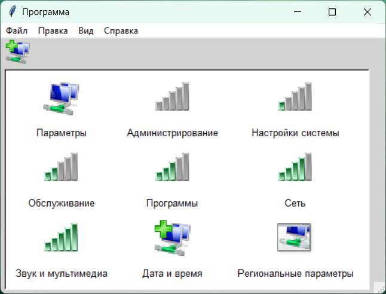

### README for Version 1.5

# tkControlPanel

tkControlPanel – это Python-программа, которая пытается повторить GUI панели управления, которая использовалась в Windows NT 3.1-3.51.

## Особенности

- Классическая тема оформления в стиле Windows NT 3.1-3.51.
- Панель управления с иконками (netcenter.dll) и текстом.
- Добавление иконок из системного ресурса Windows.
- Основное меню с разделами "Файл", "Правка", "Вид" и "Справка". 
  - Но работают только команды "Выйти", "Размер", и "О программе".
- Возможность изменения размера окна уголком. Есть уголок как в блокноте.
- Пример использования библиотеки PIL для работы с изображениями.
- Пример использования ctypes для получения системных иконок.
- Динамическая смена размеров иконок в панели управления через раздел "Вид":
  - Стандартный (32x32)
  - Большой (48x48)
  - Маленький (24x24)
- Можно использовать в качестве макета панели управления по вашему желанию.

## Зависимости

Для работы программы необходимо установить следующие библиотеки:

- `tkinter` (входит в стандартную библиотеку Python)
- `Pillow` (для работы с изображениями)

> **Примечание**: На Linux не проверял, хз как будет на нем.

Установить Pillow можно с помощью pip:

```python
pip install pillow
```

## Установка и запуск

1. Скачайте репозиторий:
Нажмите зеленую кнопку "Code" и выберите "Download ZIP".

2. Откройте то, что скачали и распакуйте архив.

3. Запустите программу:
```python
python control.py
```
Или дважды щелкните на файл `control.py`.
